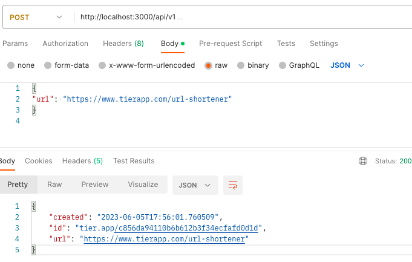
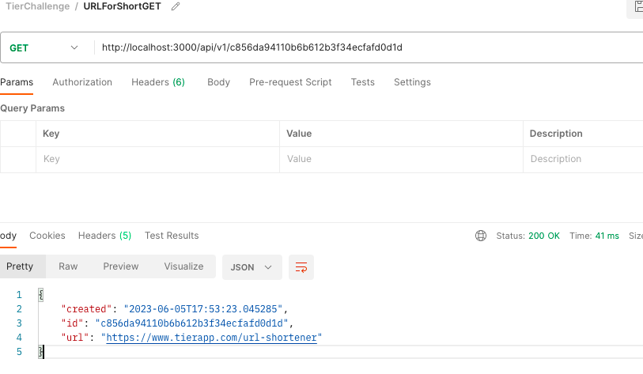
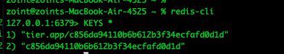
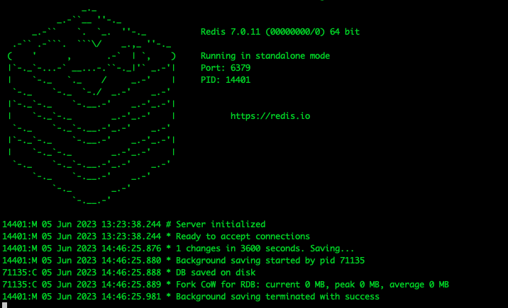

### REQUIREMENTS

Before you run please type the following command: 

```bash 
mvn clean install spring-boot:repackage -DskipTests=true
```


### INFORMATION 

Install redis database for macos

```bash
brew install redis
redis-server
```
Redis-server command open  the server. You need to do it first.

Check redis-cli version with the following command: 

```bash 
redis-cli
```

Send a ping message to redis-cli 

```bash 
redis-cli ping
```


Run Spring boot application

```bash
mvn spring-boot:run
```

## RESULT

Request
```bash 
> HTTP POST -> http://localhost:3000/api/v1
Request Body
{
"url": "https://www.tierapp.com/url-shortener"
}
```

Response Body
```bash 
{
"id": "12312313",
"url": "https://www.tierapp.com/url-shortener",
"created": "2019-02-18T13:29:14.449"
}
```
Return from the DB Redis

Request
```bash 
HTTP GET -> http://localhost:3000/api/v1/12312313
Response Body
```

```bash 
{
"id": "5446d139",
"url": "https://www.codeprimers.com/url-shortener",
"created": "2019-02-18T13:29:14.449"
}
```


You can see the result under the /img folder.

Result 1: 



Result 2: 



Result from terminal REDIS: 



Sample out output redis

